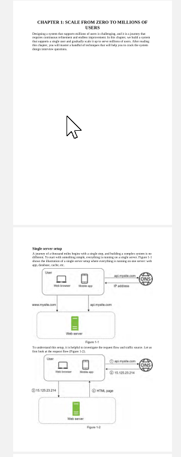
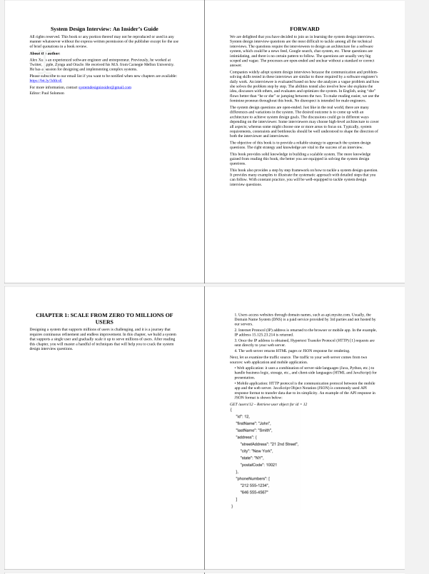

# PDF Tools

A modern GUI application for PDF manipulation using CustomTkinter. Apply 2-up imposition and page reordering with a clean, dark-themed interface.

## Features

- **2-Up Imposition**: Combine two pages into one, with optional left/right page swapping
- **Page Reordering**: Apply 1,3,2,4 pattern for booklet-style page arrangement
- **Combined Operation**: Reorder pages and apply 2-up imposition in a single step
- **Modern UI**: Clean dark theme interface built with CustomTkinter

## Requirements

- Windows 10/11
- Python 3.14+
- External tools (auto-downloaded):
  - [qpdf](https://github.com/qpdf/qpdf) - PDF manipulation
  - [pdfcpu](https://github.com/pdfcpu/pdfcpu) - PDF processing

## Installation

### Option 1: Using the Executable (Recommended)

1. Download the latest `main.exe` from [Releases](../../releases)
2. Run `main.exe` - no Python installation required

### Option 2: From Source

1. Clone the repository:
```bash
git clone <repository-url>
cd testHugging
```

2. Install dependencies:
```bash
pip install -e .
```

3. Run the application:
```bash
python main.py
```

## Building the Executable

To create a standalone `.exe` file:

```bash
# Install PyInstaller if not already installed
pip install pyinstaller

# Run the build script
build.bat
```


The executable will be created in `dist/main.exe`.

## Dependencies Download

The application requires `qpdf.exe` and `pdfcpu.exe` to function. These are automatically downloaded to the `dependencies/` folder when first run.

To manually download/update these tools:
```bash
python dependencies/download_dependencies.py
```

## Usage

1. **Select PDF**: Click "Browse" to choose a PDF file
2. **Choose Output Location**: Select destination folder (auto-filled by default)
3. **Select Operation**:
   - **2-Up Imposition**: Combines pages in pairs
   - **Reorder + 2-Up**: Applies 1,3,2,4 pattern then 2-up
4. **Configure Options**:
   - Swap left/right pages within each pair
   - Set starting page for reordering pattern
5. **Click Process**: The tool runs in background and shows result

### Before Conversion


### After Conversion


## Project Structure

```
testHugging/
├── main.py                 # Main application entry point
├── build.bat               # Build script for executable
├── pyproject.toml          # Project configuration
├── README.md               # This file
├── dependencies/
│   ├── download_dependencies.py  # Auto-download qpdf and pdfcpu
│   ├── qpdf/               # qpdf binaries (auto-downloaded)
│   └── pdfcpu.exe          # pdfcpu binary (auto-downloaded)
└── utils/
    ├── pdf_processor.py    # PDF processing logic
    ├── path_resolver.py    # Tool path resolution
    └── subprocess_utils.py # Command execution utilities
```

## License

MIT License
